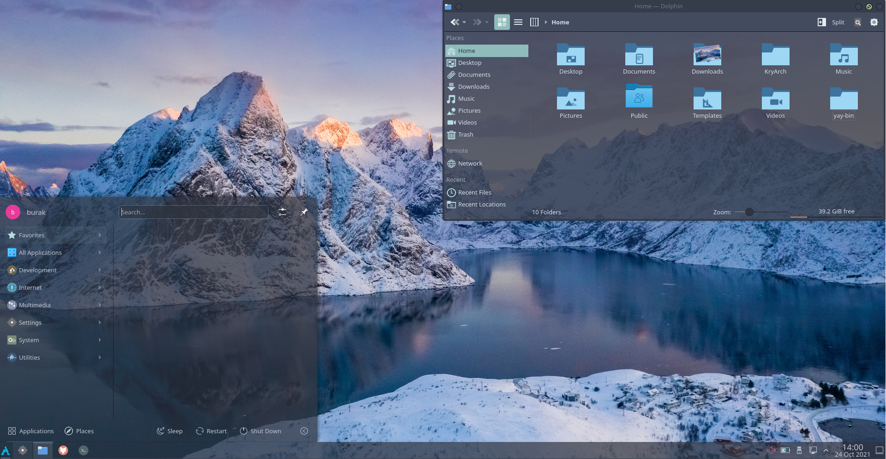
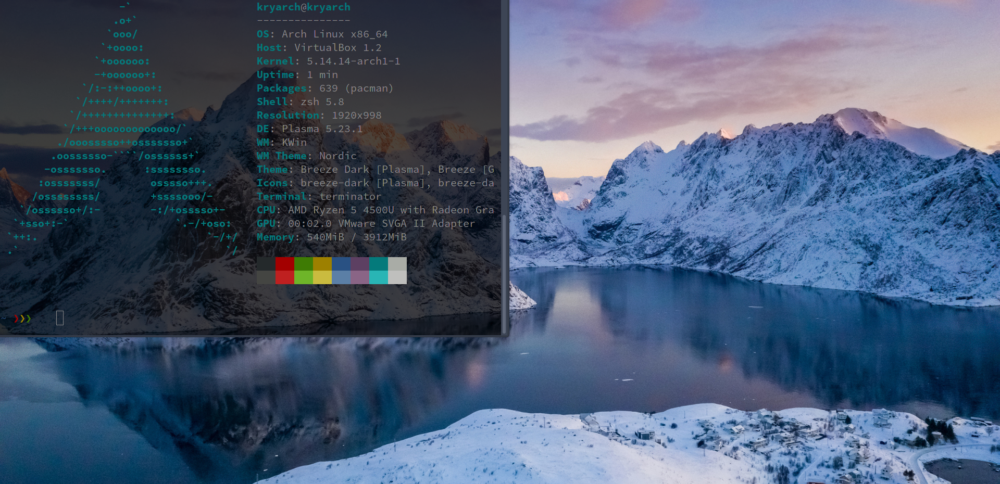

# KryArch
KryArch is an ArchLinux Install Script.
It is comfortable to use and easy to track the steps.
Installing process takes approximately 5 minutes.
Recommended desktop environment is KDE Plasma. It comes
with a freshy looking theme, and a custom terminal

## Installiation
```
pacman -Sy git
git clone https://github.com/krygeNNN/KryArch
cd KryArch
./kryarch.sh
```
##### Note
You have to enable EFI.
<br>




